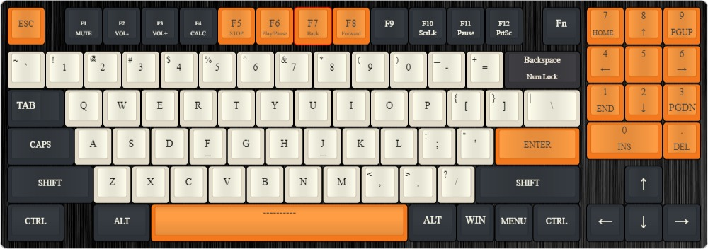

# VoltNKL-PCB

This repository contains all information around the Volt NKL (Nav Keyless) Keyboard.

Final Layout:

---

This repository contains:

- Schematics, PCB, and Components under `hardware/`
- Keyboard Layout, Designs, Part Lists, General Ideas under `media/`
- Firmware, and other software specific to a complete build under `software/`

guide used: https://wiki.ai03.com/books/pcb-design/page/pcb-guide-part-4---the-rest-of-the-schematic

MCU used in MacroPad: http://ww1.microchip.com/downloads/en/devicedoc/atmel-7766-8-bit-avr-atmega16u4-32u4_datasheet.pdf

MCU used in Keyboard https://www.st.com/content/st_com/en/products/microcontrollers-microprocessors/stm32-32-bit-arm-cortex-mcus/stm32-mainstream-mcus/stm32f0-series/stm32f0x2.html#tools-software

https://www.st.com/resource/en/datasheet/cd00237391.pdf
